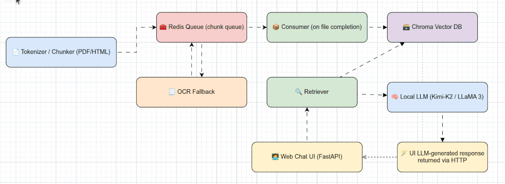
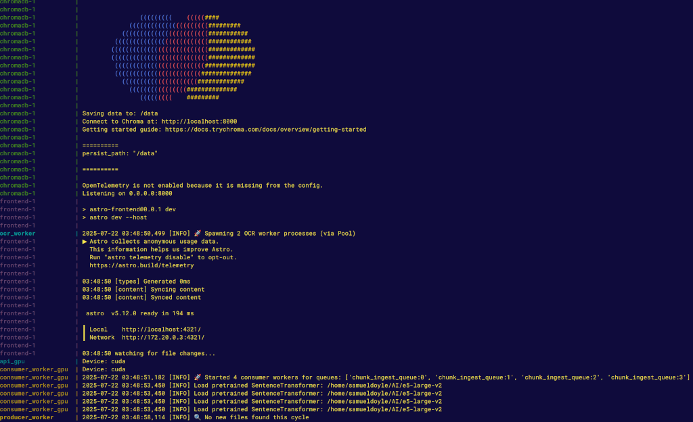
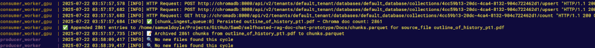

### Scalable RAG Pipeline with Distributed Ingestion and OCR Fallback

**A transparent document processing system handling mixed-quality PDFs (scanned + digital), HTML, and large document collections with automatic quality detection, distributed processing, and sub-second retrieval.**

Built with a **custom ingestion pipeline** implementing production-oriented patterns: file-level atomicity, backpressure handling, distributed workers, and automatic OCR fallback. Uses minimal LangChain wrappers only for ChromaDB/HuggingFace integration. Every component is inspectable and tunable via environment variables.

------------------------------------------------------------------------

## Problem Solved

Existing RAG tutorials and frameworks fail on real-world document collections with:

1. **Mixed quality documents**: Scanned PDFs, digital PDFs, HTML with varying text extraction success rates
2. **Large-scale processing**: Hundreds to thousands of documents requiring distributed ingestion
3. **Production guarantees**: File-level atomicity, retry logic, backpressure handling, and failure recovery

This system addresses all three by implementing:
- Automatic quality detection with OCR fallback for unreadable pages
- Distributed worker architecture with Redis-based coordination
- Transactional guarantees ensuring all chunks from a file are committed atomically

------------------------------------------------------------------------

## Performance Benchmarks

Tested on Intel i9-14900KF (24-core) + RTX 4070 12GB:

| Metric | Performance |
|--------|-------------|
| **Ingestion throughput** | 8-12 PDFs/min (mixed digital/scanned, avg 50 pages) |
| **Query latency (p50)** | ~400ms (including embedding + retrieval + generation) |
| **Query latency (p99)** | ~1200ms |
| **Vector DB capacity** | Tested with 10K+ chunks, sub-second retrieval |
| **OCR processing** | ~2-4 seconds per scanned page (Tesseract) |
| **ChromaDB embedding** | ~3-5 seconds per batch (75 chunks) |

**Note**: CPU-only mode available but 5-10x slower. Performance scales with GPU memory and core count.

------------------------------------------------------------------------

## Architecture Overview

This project implements a retrieval-augmented generation (RAG) system with three main stages:

- **Ingestion**: Documents are parsed, split into token-aware chunks,
  and embedded using `e5-large-v2`. Chunks are stored in Chroma for
  semantic search.

- **Retrieval**: At query time, top-k semantically similar chunks are
  fetched using cosine similarity.

- **Generation**: Retrieved context is passed to a local `llama-cpp` LLM
  (`Meta-Llama-3.1-8B-Instruct`) for contextual response generation.

This RAG pipeline is distributed and modular, designed to be less
abstract than frameworks like LangChain. It provides transparency and
direct access to each component.

The ingestion architecture processes documents (PDFs, HTML, scanned
images) via:

- **Producer**: Extracts and tokenizes text from documents.

- **Consumer**: Buffers and stores chunks into Chroma.

- **OCR Worker**: Uses Tesseract OCR to process scanned or image-based
  PDFs. Required for non-text PDFs.

Redis queues connect all services with coordinated backpressure,
retries, and transactional guarantees at the file level.



------------------------------------------------------------------------

### 🧠 Features

- Token-aware chunking using `transformers.AutoTokenizer`

- Fallback OCR (EasyOCR or Tesseract) for scanned PDFs

- Buffered Redis-based ingestion with file-level atomicity

- Distributed chunk batching, deduplication, and ingestion

- Vector store: https://github.com/chroma-core/chroma


🧭 Also see [arch.md](./project-docs/arch.md) for a system sequence diagram

------------------------------------------------------------------------

### 📦 Required Environment Variables

Set the following in your environment or a `.env` file:

Alternatively you can export them directly in the [run-compose.sh](./doc-ingest-chat/run-compose.sh) , you can
see an example in the file

    LLM_PATH=/path/to/Meta-Llama-3.1-8B-Instruct-Q6_K_L.gguf
    EMBEDDING_MODEL_PATH=/path/to/e5-large-v2
    INGEST_FOLDER=/absolute/path/to/your/docs

All other environment variables and defaults are defined in [ingest-svc.env](./doc-ingest-chat/ingest-svc.env)


#### 💾 Embedding and Model Setup

This system uses:

- **Embedding Model**: https://huggingface.co/intfloat/e5-large-v2

- **LLM**: https://huggingface.co/bartowski/Meta-Llama-3.1-8B-Instruct-GGUF

Models must be downloaded manually and referenced via absolute paths in
the environment file. These must be set before launching the system, as
both are critical for embedding and LLM-based response generation.


------------------------------------------------------------------------

### 🐳 Run and Test with Docker Compose

#### Start
Use the provided `run-compose.sh` script to start the stack:

```shell
./doc-ingest-chat/run-compose.sh
```

Successful Startup



#### Ingest

If your `INGEST_FOLDER` is empty of `PDF` or `HTML` files, you can copy files into that directory once running
, the directory is periodically scanned for new files.
For earlier testing I used:
* [The Outline Of History PT1](https://archive.org/download/outlineofhistory01welluoft/outlineofhistory01welluoft.pdf)
* [The Outline Of History PT2](https://archive.org/download/outlineofhistory02welluoft/outlineofhistory02welluoft.pdf)

> 🗂️ **NOTE** These PDF files contain several scanned pages which cannot be parsed by `pdfplumber`. In these cases
> the `ocr` fallback is triggered which results in the chunk(s) sent to the `OCR_WORKER` via redis.
> This results in a much slower ingestion if there are many pages but the purpose is to demonstrate the fallback
> handling feature

Successful Ingest



#### RAG

Once running:
* The ingestion API will be available at `http://localhost:8000`
* The local Astro frontend will be served at `http://localhost:4321`

The UI is a basic chatbox , queries for the session maintain conversation history. From here
you can ask relevant queries based on the documents you have ingested.


#### *CPU Mode Only*
Optionally a CPU only mode can be used if running on system with non-nvidia or lower end GPU.
Note though this will likely run very slow and likely need to modify the llama and/or retriever
properties in the `ingest-svc.env`

```sh
./doc-ingest-chat/run-compose-cpu.sh
```

### 📁 Output Artifacts

- **Parquet file of all embedded chunks** (`chunks.parquet`) and
  **DuckDB file** (`chunks.duckdb`) — DuckDB is the primary store and is
  updated first; the Parquet file is regenerated from DuckDB to support
  append-only archival and external analytics tools. DuckDB also allows
  efficient in-place querying of recent and historical chunks.

- `failed_files.txt` for skipped files

- `producer_failed_chunks.json` and `consumer_failed_chunks.json` for
  diagnostics
 
------------------------------------------------------------------------


### 🧮 Embedding Behavior and Bias

The embedding model (`e5-large-v2`) is used during ingestion to convert
text chunks into semantic vectors. Unlike LLMs, it does not generate
language — it only maps inputs to fixed-size embeddings
deterministically.

This means there is **no stochasticity** and **no generation bias**
during ingestion. However, any "bias" in this step comes from the
embedding model's training data — it influences what the model considers
similar or important. If a concept was underrepresented during training,
its embeddings may cluster poorly or produce weak retrieval matches.

Understanding this helps clarify that while the LLM governs response
generation, the embedding model governs what content even reaches that
stage.


------------------------------------------------------------------------


### 📤 How the LLM Is Used

The LLM (`llama-cpp`) is only used during the **Generation** phase of
RAG. It does not participate in ingestion or retrieval.

- During **ingestion**, documents are embedded using `e5-large-v2`, a
  sentence transformer model — no LLM is invoked.

- During **retrieval**, Chroma uses vector similarity to return relevant
  chunks — again, no LLM is needed.

- Only during **generation** is the LLM called, where it receives the
  retrieved chunks as prompt context and produces a final response.

This separation improves performance and debuggability, ensuring that
embedding and retrieval steps are deterministic and inspectable.


------------------------------------------------------------------------


### 🔧 Why Custom Ingestion Pipeline (vs LangChain Orchestration)

**What Uses LangChain**: Minimal wrappers for ChromaDB integration (`langchain_chroma.Chroma`) and HuggingFace embeddings (`langchain_huggingface.HuggingFaceEmbeddings`).

**What Doesn't**: The entire ingestion pipeline - producer/consumer/OCR workers, Redis queue coordination, chunking logic, quality detection, backpressure handling, atomicity guarantees.

This custom approach implements patterns needed for production that frameworks don't provide:

**1. Performance Optimization**
- Direct control over batching strategies (dynamic batch sizing based on token counts)
- Custom backpressure implementation preventing OOM errors
- Token-aware chunking using the actual embedding model's tokenizer
- Zero overhead from abstraction layers

**2. Operational Transparency**
- Every parameter exposed via environment variables for A/B testing
- Direct access to Redis queues, ChromaDB collections, and DuckDB for debugging
- Explicit retry logic and error handling (no hidden framework behavior)
- Full logging of pipeline stages with performance metrics

**3. Production Requirements**
- File-level transactional guarantees (atomicity not provided by LangChain)
- Distributed worker architecture with multiprocessing pools
- OCR fallback pipeline with quality detection and automatic retry
- Comprehensive failure tracking (per-file, per-chunk diagnostics)

**Comparison (Ingestion Pipeline):**

| Aspect | Custom Ingestion (This Project) | LangChain Document Loaders |
|--------|--------------------------------|---------------------------|
| **Setup Time** | 2-3 days initial build | Hours to prototype |
| **Control** | Full - every component configurable | Partial - framework constraints |
| **Performance Tuning** | Precise (batching, chunking, retries) | Limited without forking framework |
| **Production Readiness** | Atomicity, backpressure, monitoring built-in | Requires additional engineering |
| **Debugging** | Direct access to all components | Navigate framework abstractions |
| **Scaling** | Explicit worker pools, queue management | Single-threaded document loaders |
| **OCR Fallback** | Automatic quality detection + retry | Manual implementation required |
| **Ideal For** | Production deployments requiring control | Rapid prototyping, low-code demos |

**When to Use Each:**
- **Custom Ingestion**: Production systems processing 1000+ documents with mixed quality, SLAs, or need for distributed processing
- **LangChain Loaders**: Proof-of-concepts, demos, small document collections (<100 files)

**Note**: This project uses LangChain's ChromaDB and HuggingFace wrappers for convenience, but the ingestion pipeline (the complex part) is entirely custom. This demonstrates you can leverage helpful integrations while maintaining control over critical business logic.


------------------------------------------------------------------------


### 🛠️ Debugging and Inspection

#### Redis Queue Inspection

To inspect if ingestion is progressing:

- Use the Redis CLI or GUI to check the state of producer and consumer
  queues:

```bash

redis-cli -p 6379
redis-cli -p 6380

> LRANGE chunk_ingest_queue:0 0 -1
> LRANGE chunk_ingest_queue:1 0 -1
````

If the queues remain full or never drain, check consumer logs. Each
chunk is pushed with metadata, followed by a sentinel `file_end`
message.

#### DuckDB Inspection

To explore or debug ingested data:

```sql
    -- Connect to DuckDB shell
    duckdb /path/to/chunks.duckdb

    -- Sample queries:

    -- View chunk counts by engine type
    SELECT engine, COUNT(*) FROM chunks GROUP BY engine;

    -- Check if specific content (e.g. "Bretton") exists
    SELECT * FROM chunks WHERE text ILIKE '%bretton%';

    -- View per-file chunk totals
    SELECT source_file, COUNT(*) FROM chunks GROUP BY source_file ORDER BY COUNT(*) DESC;
```

These queries are helpful to verify ingestion completeness or to debug
why certain content isn't retrieved during RAG responses.

Additional examples:

#### Advanced Queries for Troubleshooting

```sql
    -- Show all chunk rows from files with 'Bretton' OR 'Woods' in them
    SELECT * FROM chunks WHERE text ILIKE '%bretton%' OR text ILIKE '%woods%';

    -- Find chunk counts for files that likely mention monetary systems
    SELECT source_file, COUNT(*) FROM chunks 
    WHERE text ILIKE '%currency%' OR text ILIKE '%exchange rate%' OR text ILIKE '%gold standard%'
    GROUP BY source_file ORDER BY COUNT(*) DESC;

    -- Check for empty or too-short text chunks
    SELECT * FROM chunks WHERE length(text) < 10;

    -- Check chunk length distribution to detect overly small or excessively large chunks
    SELECT length(text) AS token_count, COUNT(*) 
    FROM chunks 
    GROUP BY token_count 
    ORDER BY token_count DESC;

    -- Find chunks with unusual or null metadata (e.g., missing engine label)
    SELECT * 
    FROM chunks 
    WHERE engine IS NULL OR engine = '';

    -- Review a sample of chunks from a specific source
    SELECT * 
    FROM chunks 
    WHERE source_file LIKE '%bretton%' 
    LIMIT 10;

    -- 🔎 Inspect how often certain keywords appear in chunks
    SELECT 
      COUNT(*) FILTER (WHERE text ILIKE '%inflation%') AS inflation_hits,
      COUNT(*) FILTER (WHERE text ILIKE '%deflation%') AS deflation_hits,
      COUNT(*) FILTER (WHERE text ILIKE '%interest rate%') AS interest_rate_hits
    FROM chunks;

    -- Count how many chunks exist per unique document file
    SELECT source_file, COUNT(*) 
    FROM chunks 
    GROUP BY source_file 
    ORDER BY COUNT(*) DESC;

    -- Detect duplicate chunk texts (possible over-splitting or OCR duplication)
    SELECT text, COUNT(*)
    FROM chunks
    GROUP BY text
    HAVING COUNT(*) > 1
    ORDER BY COUNT(*) DESC
    LIMIT 10;
```

------------------------------------------------------------------------

### 📊 Performance Metrics

The system collects performance metrics at key points in the document processing pipeline to help identify bottlenecks and monitor system health.

#### Metrics Overview

Metrics are emitted as structured JSON logs to both stdout and a dedicated metrics file (`metrics.jsonl` by default). Three event types are tracked:

- **`file_processing_complete`** - Producer worker metrics (document extraction, OCR, chunking, Redis enqueue)
- **`file_storage_complete`** - Consumer worker metrics (ChromaDB embedding/storage, Parquet writes)
- **`ocr_job_complete`** - OCR worker metrics (Tesseract execution, image processing)

#### Example Metrics Output

```jsonl
{"event":"file_processing_complete","timestamp":"2025-12-26T10:30:45.123456","worker":"producer","file":"docs/sample.pdf","metrics":{"total_processing_time_ms":15234.5,"text_extraction_time_ms":8120.3,"redis_enqueue_time_ms":120.8,"ocr_operations":[{"page":3,"ocr_roundtrip_time_ms":2340.5,"engine":"tesseract","success":true}],"chunks_produced":47,"pages_processed":12}}
{"event":"file_storage_complete","timestamp":"2025-12-26T10:30:50.789012","worker":"consumer","file":"docs/sample.pdf","queue":"chunk_ingest_queue:0","metrics":{"total_storage_time_ms":4523.7,"chromadb_embedding_time_ms":3890.2,"parquet_write_time_ms":183.0,"chunks_stored":47,"batches_processed":1}}
{"event":"ocr_job_complete","timestamp":"2025-12-26T10:30:48.456789","worker":"ocr","file":"docs/sample.pdf","page":3,"job_id":"abc123","metrics":{"total_processing_time_ms":2340.5,"tesseract_execution_time_ms":2280.1,"image_decode_time_ms":45.3,"engine":"tesseract","text_length":1024,"success":true}}
```

#### Analyzing Metrics

Use `jq` to analyze the metrics file:

```bash
# Average ChromaDB storage time per file
jq -r 'select(.event == "file_storage_complete") | .metrics.chromadb_embedding_time_ms' metrics.jsonl | awk '{sum+=$1; count+=1} END {print "Avg ChromaDB time: " sum/count " ms"}'

# Files with longest processing times (top 20)
jq -r 'select(.event == "file_processing_complete") | "\(.metrics.total_processing_time_ms)\t\(.file)"' metrics.jsonl | sort -rn | head -20

# OCR roundtrip timing statistics (min/max/avg)
jq -r 'select(.event == "ocr_job_complete") | .metrics.total_processing_time_ms' metrics.jsonl | awk '{sum+=$1; count+=1; if(min==""){min=max=$1} if($1>max){max=$1} if($1<min){min=$1}} END {print "OCR timing - Min: " min "ms, Max: " max "ms, Avg: " sum/count "ms"}'

# Total chunks processed
jq -s '[.[] | select(.event == "file_storage_complete") | .metrics.chunks_stored] | add' metrics.jsonl

# Count files that required OCR fallback
jq -r 'select(.event == "file_processing_complete" and .metrics.ocr_operations) | .file' metrics.jsonl | wc -l

# Average chunks per file
jq -r 'select(.event == "file_storage_complete") | .metrics.chunks_stored' metrics.jsonl | awk '{sum+=$1; count+=1} END {print "Avg chunks per file: " sum/count}'

# Identify slow ChromaDB operations (>5 seconds)
jq -r 'select(.event == "file_storage_complete" and .metrics.chromadb_embedding_time_ms > 5000) | "\(.metrics.chromadb_embedding_time_ms)ms\t\(.file)"' metrics.jsonl
```

#### Configuration

Metrics collection can be configured via environment variables in `ingest-svc.env`:

```bash
# Enable or disable metrics collection
METRICS_ENABLED=true

# File path for metrics output (JSONL format)
METRICS_LOG_FILE=${INGEST_FOLDER}/metrics.jsonl

# Also log metrics to stdout
METRICS_LOG_TO_STDOUT=true
```

Metrics provide visibility into:
- **Bottlenecks**: Identify which operations (text extraction, OCR, embedding, storage) consume the most time
- **OCR usage**: Track how many pages required OCR fallback and their processing times
- **Throughput**: Calculate chunks processed per second, files per hour
- **System health**: Detect anomalies like unusually slow ChromaDB writes or OCR timeouts

------------------------------------------------------------------------

### 🎯 Design Philosophy

**Custom Ingestion Pipeline**: The entire document processing pipeline (producer/consumer/OCR workers, Redis coordination, chunking, quality detection) is built from scratch without framework orchestration. LangChain is used only as a thin wrapper for ChromaDB and HuggingFace embeddings - not for pipeline logic.

This architecture maintains full control over:

**1. Chunking Strategy**
- Token-aware splitting using the actual embedding model's tokenizer (e5-large-v2)
- Configurable chunk size with automatic boundary detection
- Page-level metadata preservation for source attribution

**2. Quality Assurance**
- Multi-stage text quality detection (gibberish, corruption, encoding validation)
- Automatic OCR fallback with Tesseract when pdfplumber extraction fails
- Latin script ratio checking with configurable thresholds

**3. Production Guarantees**
- File-level atomicity: all chunks from a document commit together or not at all
- Redis-based backpressure to prevent memory overflow
- Distributed worker pools with multiprocessing
- Comprehensive error tracking and retry logic

**4. Transparency and Tunability**
- All parameters exposed via environment variables (`ingest-svc.env`)
- Direct access to vector DB, Redis queues, and DuckDB for inspection
- No hidden abstractions or magic behavior
- Full logging with emoji-coded event types for easy scanning

This approach trades ease-of-setup for operational control, making it suitable for understanding RAG systems deeply and adapting to specific production requirements.

------------------------------------------------------------------------

### 🏗️ Production Considerations

This system demonstrates core patterns for production RAG deployments. For scaling to enterprise use:

#### What Would Change for Production

**High-Priority Additions:**
- **Authentication/Multi-tenancy**: Add user isolation, API keys, quota management
- **Monitoring & Alerting**: Integrate with Prometheus/Grafana for real-time dashboards
- **Batch API**: Job queue with progress tracking and webhook callbacks
- **Vector DB Partitioning**: Shard ChromaDB for 100K+ document collections
- **Caching Layer**: Redis cache for frequently accessed chunks and embeddings
- **Cost Tracking**: Usage-based metering for compute, storage, and API calls

**Infrastructure Changes:**
- **Clustered Redis**: Redis Sentinel or Cluster for high availability
- **Managed Vector DB**: Consider Pinecone, Weaviate, or Qdrant for production scale
- **Object Storage**: Move document storage to S3/GCS with CDN for global access
- **Kubernetes Deployment**: Horizontal pod autoscaling for worker pools
- **Separate Compute Tiers**: CPU workers for text extraction, GPU workers for OCR

**Operational Improvements:**
- **Dead Letter Queues**: Capture and retry failed chunks with exponential backoff
- **Circuit Breakers**: Prevent cascade failures when downstream services are slow
- **Rate Limiting**: Protect embedding API and LLM from overload
- **A/B Testing Framework**: Compare chunking strategies and retrieval algorithms
- **Audit Logging**: Track all queries and document access for compliance

#### Cost Analysis (Estimated)

For a 10,000 document corpus (avg 50 pages, 500K chunks):

| Component | Self-Hosted Cost | Managed Service Alternative |
|-----------|------------------|----------------------------|
| **Compute (ingestion)** | $200/month (dedicated GPU server) | $500-800/month (GPU VMs on-demand) |
| **Vector DB storage** | $50/month (1TB SSD) | $200-400/month (Pinecone/Weaviate) |
| **Redis** | $20/month (managed Redis) | $50-100/month (Redis Enterprise) |
| **LLM inference** | Included in compute | $0.002/query (OpenAI) = $200/month @ 100K queries |
| **Total** | ~$270/month | ~$950-1500/month |

**Trade-offs**: Self-hosted has higher upfront effort but lower marginal costs. Managed services offer better scalability and reliability but at 3-5x cost.

------------------------------------------------------------------------

### 📌 Current Scope and Limitations

**Designed For:**
- Document collections under 50,000 chunks (~5,000 documents)
- Single-organization use (no multi-tenancy)
- Trusted internal environment (no authentication required)
- Single-node deployment (Redis and ChromaDB not clustered)

**Known Limitations:**
- **CPU-only mode**: Available but 5-10x slower than GPU mode
- **No incremental updates**: Modifying a document requires re-ingestion
- **Single embedding model**: Changing models requires re-embedding entire corpus
- **No cross-document reasoning**: Each query retrieves from individual chunks
- **Limited language support**: Optimized for English and Latin-script languages

**Not Included:**
- Web UI for admin/monitoring (only chat interface provided)
- Document versioning or change tracking
- Semantic chunking (uses fixed token-based splitting)
- Query rewriting or expansion
- Result re-ranking or fusion

These are intentional scope decisions to maintain focus on core RAG pipeline mechanics. Production deployments would add these based on specific requirements.

------------------------------------------------------------------------

### 🖥️ Hardware Used for Testing

This system was developed and tested on:

- **CPU**: Intel Core i9-14900KF (24-core)
- **GPU**: NVIDIA RTX 4070 Dual 12GB
- **RAM**: 32 GB DDR5
- **Storage**: 1TB NVMe Gen4 SSD
- **OS**: Ubuntu 22.04 LTS (64-bit)
- **Python**: 3.11
- **Docker**: 24.0.5

Performance metrics in this README reflect this hardware configuration.
