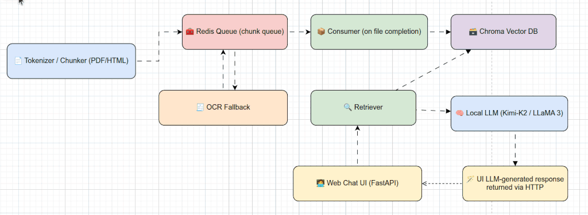

# 🚀 Scalable RAG Pipeline (Self-Hosted)

**A transparent document processing system handling mixed-quality PDFs (scanned + digital), HTML, and large document collections with automatic OCR fallback.**



---

### 💡 The Problem & The Solution
Most RAG tutorials fail when they hit real-world document collections. They struggle with **mixed quality** (scanned vs. digital), **scale** (thousands of files), and **production guarantees** (atomicity, retries, backpressure). 

This project solves those issues by implementing a **custom, multi-process distributed ingestion pipeline** that ensures every chunk of every document is processed, embedded, and stored reliably.

---

### 🛠️ Core Tech Stack
- **🤖 AI & ML**: `Meta-Llama-3.1-8B-Instruct` (via Llama.cpp), `e5-large-v2` (Sentence Transformers).
- **⚙️ Backend**: Python, FastAPI, Multi-process Workers.
- **📡 Coordination & Queues**: Redis (Message Broker, Backpressure, Atomicity).
- **📄 Document Processing**: `pdfplumber` (Extraction), `Tesseract OCR` (Fallback), `transformers` (Tokenization).
- **💾 Storage & Analytics**: `Qdrant` / `ChromaDB` (Vector Search), `DuckDB` (Metadata Analytics), `Parquet` (Archival).
- **🎨 Frontend**: Astro, Tailwind CSS.

---

### 🧬 The Data Ingestion Journey (Step-by-Step)
*Perfect for scrolling through at a meetup or conference!*

#### **Step 1: Producer Scanning & Scaling**
The **Producer worker** is designed for massive scale. It can scan an `INGEST_FOLDER` containing **1,000s of PDF and HTML files** concurrently. It uses a multi-process pool to parallelize file discovery and initial metadata extraction.

#### **Step 2: Smart Extraction & Token-Aware Chunking**
Text is extracted rapidly using `pdfplumber`. Instead of simple character-based splitting, we use a **token-aware tokenizer** (`transformers.AutoTokenizer`) to ensure chunks are perfectly sized for the `e5-large-v2` embedding model.

#### **Step 3: Intelligent OCR Fallback**
If text extraction fails (e.g., a scanned image PDF or corrupted encoding), the system automatically triggers an **OCR fallback**. Those specific pages are routed to a dedicated **Tesseract OCR Worker**, ensuring no data is missed, regardless of the source quality.

#### **Step 4: Redis Queueing & Atomicity**
All extracted chunks are enqueued in **Redis**. This acts as our distributed coordinator, providing:
- **Backpressure Handling**: Prevents memory overflow by throttling ingestion based on queue depth.
- **File-Level Atomicity**: All chunks from a single document are committed together or not at all, preventing partial ingestions.

#### **Step 5: Consumer Processing & Dual Storage**
The **Consumer worker** pulls batches of chunks from Redis, embeds them, and performs a **dual-write storage operation**:
1. **Vector Search**: Chunks are stored in **Qdrant** (or ChromaDB) for high-speed semantic retrieval.
2. **Relational Analytics**: Metadata and text are stored in **DuckDB**, allowing for complex SQL-based analytics and audit trails.

---

### 📊 Performance Benchmarks
*Tested on Intel i9-14900KF + RTX 4070 12GB*

| Metric | Performance |
|--------|-------------|
| **Ingestion throughput** | 8-12 PDFs/min (Mixed quality, avg 50 pages) |
| **Query latency (p50)** | ~400ms (Embedding + Retrieval + Generation) |
| **Query latency (p99)** | ~1200ms |
| **Vector DB capacity** | Tested with 10K+ chunks, sub-second retrieval |
| **OCR processing** | 2-4 seconds per scanned page (Tesseract) |
| **ChromaDB embedding** | 3-5 seconds per batch (75 chunks) |

---

### 🏃‍♂️ Quick Start (Step-by-Step)

Want to see it in action? Follow these steps to get the system running locally.

#### **1. Get the Models**
The system runs entirely locally. You will need to download two models and reference them via absolute paths:
1. **Embedding Model**: [e5-large-v2](https://huggingface.co/intfloat/e5-large-v2)
2. **LLM**: [Phi-3.5-mini](https://huggingface.co/bartowski/Phi-3.5-mini-instruct_Uncensored-GGUF)

#### **2. Configure & Launch**
*Optional*: Set up your environment variables to override defaults(see `doc-ingest-chat/ingest-svc.env` for defaults) and start the Docker Compose stack:

**NOTE:** Depending on your system resources the ingestion process (chunking + tokenization + qdrant persist) and RAG (chat)
may take longer than expected, information is updated on the console where docker-compose was started

```bash
# Export required env vars

# INGEST_FOLDER: Directory inside the container where files are read for ingestion. Must match the right side of the data volume mount.
export INGEST_FOLDER=/home/myname/Projects/selfhosted-rag-doc-chat-prototype/Docs

# If you want some docs to test with 
cd $INGEST_FOLDER
curl -LsS https://archive.org/download/outlineofhistory01welluoft/outlineofhistory01welluoft.pdf -o outline_of_history_pt1.pdf
curl -LsS https://archive.org/download/outlineofhistory02welluoft/outlineofhistory02welluoft.pdf -o outline_of_history_pt2.pdf

# Model Paths
# EMBEDDING_MODEL_PATH: Path inside the container to the E5 model directory. Must match the right side of the E5 model volume mount.
# Only tested with e5-large-v2
# https://huggingface.co/intfloat/e5-large-v2/blob/main/model.safetensors
export EMBEDDING_MODEL_PATH=-/home/myname/AI_LOCAL/Models/e5-large-v2

# LLM_PATH: Path inside the container to the Llama model file. Must match the right side of the Llama model volume mount.
# Last tested with Phi-3.5-mini
# https://huggingface.co/bartowski/Phi-3.5-mini-instruct_Uncensored-GGUF
export LLM_PATH=/home/myname/AI_LOCAL/Models/Phi/Phi-3.5-mini-instruct-Q4_K_M.gguf

# Start the full stack (GPU mode is default)
./doc-ingest-chat/run-compose.sh

# open browser
http://localhost:4321/
# sample prompt
"Who was Constantine the Great ?"

# Or, start in CPU-only mode (much slower)
./doc-ingest-chat/run-compose-cpu.sh
```

**Successful Startup:**


#### **3. Ingest Documents**
Drop your documents into the `INGEST_FOLDER`. The system continuously scans this folder and processes them via the distributed pipeline.

**Successful Ingest:**


#### **4. Chat!**
Once running, open the Astro frontend at `http://localhost:4321`. Ask questions and the system will retrieve context and generate grounded answers.


---

### 📚 Detailed Documentation & Deep Dives

Explore more technical details in our project documentation:

- 🏗️ **[Architecture Overview: LangGraph Streaming Ingestion](./project-docs/architecture_overview.md)**: A deep dive into the state-machine-based orchestration and streaming data flow.
- ⚖️ **[Why Custom Pipeline vs Langchain?](./project-docs/custom_vs_langchain.md)**: Explore the architectural decisions and why we built a custom distributed pipeline instead of using basic Langchain loaders.
- 🛠️ **[Debugging, Inspection & Metrics](./project-docs/debugging_and_metrics.md)**: How to inspect Redis queues, query DuckDB, and analyze system performance metrics (JSONL).
- 🏗️ **[Production Considerations](./project-docs/production_considerations.md)**: Strategies for scaling, cost analysis, and what features are needed for an enterprise deployment.
- 🧮 **[AI Behavior & Usage](./project-docs/ai_behavior.md)**: Understand embedding bias and exactly how and where the LLM is utilized in the pipeline.

---

### 🖥️ Hardware Used for Testing
- **CPU**: Intel Core i9-14900KF (24-core)
- **GPU**: NVIDIA RTX 4070 Dual 12GB
- **RAM**: 32 GB DDR5
- **OS**: Ubuntu 22.04 LTS (64-bit) / Python 3.11
