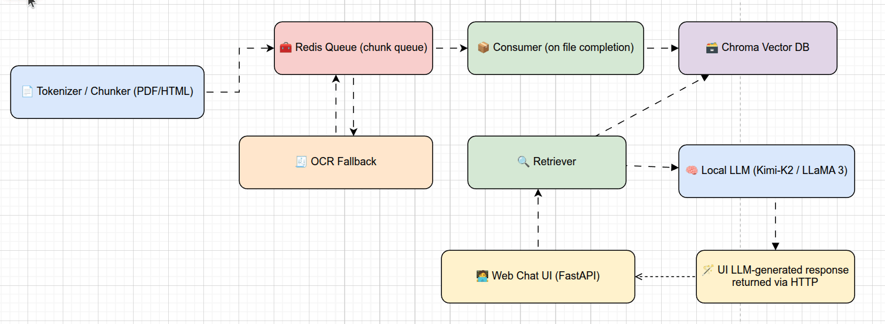
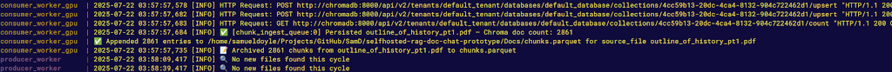
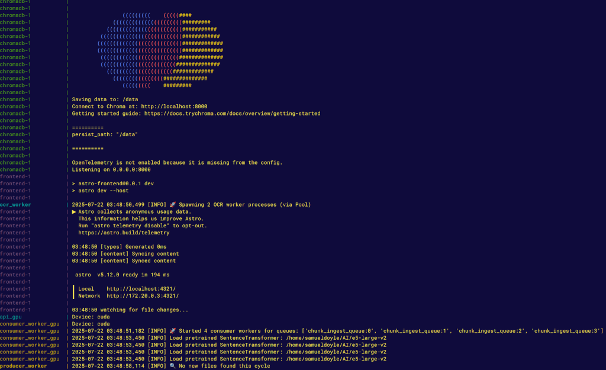
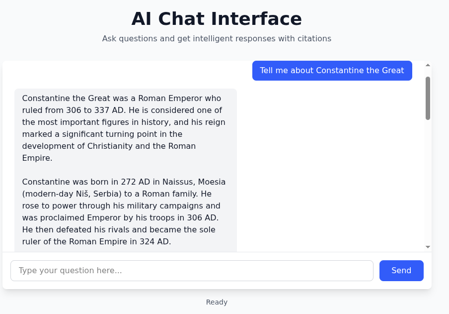

# 🚀 Scalable RAG Pipeline (Self-Hosted)

**A transparent document processing system handling mixed-quality PDFs (scanned + digital), HTML, and large document collections with automatic OCR fallback.**



---

### High Level Component View


---

### 💡 The Problem & The Solution
Most RAG tutorials fail when they hit real-world document collections. They struggle with **mixed quality** (scanned vs. digital), **scale** (thousands of files), and **production guarantees** (atomicity, retries, backpressure). 

This project solves those issues by implementing a **custom, multi-process distributed ingestion pipeline** that ensures every chunk of every document is processed, embedded, and stored reliably using a DuckDB-backed state machine.

---

### ✨ Key Technical Features
- **Atomic State Machine**: Driven by a database-backed lifecycle (DuckDB), ensuring zero race conditions and robust file handoffs.
- **Phased Normalization**: Converts unpredictable PDFs into high-quality Markdown using specialized LLM "Stateless Retyping."
- **Hierarchical Chunking**: Markdown-aware splitting that preserves semantic context and stays strictly under a 512-token limit (e5-large-v2).
- **Computer Vision Fallback**: Automatic OCR for scanned/unreadable pages using Docling (EasyOCR).
- **Media Transcription**: High-fidelity transcription for `.mp4` and `.mp3` files using a dedicated WhisperX container, ensuring dependency isolation and GPU acceleration.
- **Zero-Memory Archival**: Chunks are staged in DuckDB before persistence, allowing for massive (1000+ page) document processing without OOM crashes.

---

### 🛠️ Core Tech Stack
- **🤖 AI & ML**: `Phi-4-mini` (Normalization + RAG), `e5-large-v2` (Embeddings), `WhisperX` (Transcription).
- **⚙️ Backend**: Python, FastAPI, Multi-process Workers.
- **📡 Coordination**: Redis (Message Broker, Backpressure, Atomicity).
- **📄 Document Processing**: `pdfplumber` (Extraction), `Docling (EasyOCR)` (Computer Vision), `WhisperX` (Media), `transformers` (Tokenization).
- **💾 Storage**: `Qdrant` (Vector Search), `DuckDB` (State Machine), `Parquet` (Archival).
- **🎨 Frontend**: Astro, Tailwind CSS.

---

### 🧬 The Data Ingestion Journey (Detailed)

#### **Step 1: GateKeeper (Normalization)**
The **GateKeeper** claims raw assets from the `staging/` directory. It uses a **Chain of Responsibility** to dispatch files to specialized handlers:
- **PDFs**: It checks the text layer of every page. If a page is scanned, it renders it to an image and offloads it to the **OCR Worker** (Docling).
- **Media (MP4/MP3)**: It offloads the file to the dedicated **WhisperX Worker** for high-fidelity transcription and alignment.
- **Normalization**: All raw text streams are sent to the **Normalization LLM** (`SUPERVISOR_LLM_PATH`) to "retype" the content into clean Markdown. To ensure 100% citation accuracy, it injects explicit `### [INTERNAL_PAGE_X]` or timestamp anchors into the Markdown stream.

#### **Step 2: Producer (Chunking & Enrichment)**
The **Producer** claims the normalized Markdown. It performs hierarchical splitting based on headers and detects the `[INTERNAL_PAGE_X]` tags to assign the correct physical page number to every chunk. It injects a deterministic `[DOC_ID]` (MurmurHash3) into every chunk for deduplication. Once complete, it sends a `file_end` sentinel.

#### **Step 3: Consumer (Persistence)**
Chunks are enqueued to **Redis** (including the mandatory `passage: ` prefix). The **Consumer** pulls these chunks and stages them in **DuckDB** using high-performance Pandas-batching until the `file_end` sentinel arrives. Only then are they embedded and upserted into **Qdrant** as a single atomic transaction.

**Successful Ingest State:**


---

### 📊 Performance Benchmarks
*Tested on Intel i9-14900KF + RTX 4070 12GB*

| Metric | Performance |
|--------|-------------|
| **Ingestion throughput** | 10-15 PDFs/min (Mixed quality, avg 50 pages) |
| **Query latency (p50)** | ~400ms (Embedding + Retrieval + Generation) |
| **Query latency (p99)** | ~1200ms |
| **Vector DB capacity** | Tested with 10K+ chunks, sub-second retrieval |
| **OCR processing** | 2-4 seconds per scanned page (Docling EasyOCR) |
| **Vector persistence** | Atomic upsert via DuckDB-to-Qdrant bridge |

---

### 🏃‍♂️ Quick Start (Step-by-Step)

#### **1. Prerequisites**
- **Docker & Docker Compose**: (v2.20+)
- **NVIDIA Container Toolkit**: (If using GPU)
- **Node.js**: **v22.12.0+** (For Frontend development)

#### **2. Get the Models**
You will need to download these locally and reference them via absolute paths:
1. **Embedding Model**: [e5-large-v2](https://huggingface.co/intfloat/e5-large-v2)
2. **LLM (Inference)**: [Phi-4-mini](https://huggingface.co/microsoft/Phi-4-mini-instruct-GGUF) (or any GGUF/API compatible model).

#### **3. Configure & Launch**
Set up your environment variables. **Note:** `LLM_PATH` and `SUPERVISOR_LLM_PATH` support both absolute file paths (GGUF) and `http(s)` endpoints for remote `llama-server` or Ollama instances.

```bash
# REQUIRED: The root directory for all lifecycle stages (staging, success, etc.)
export DEFAULT_DOC_INGEST_ROOT=/home/user/my-rag-docs

# Staging directory where you drop your raw PDFs
export STAGING_DIR=${DEFAULT_DOC_INGEST_ROOT}/staging

# If you want some high-quality history docs to test with:

# PDF
mkdir -p $STAGING_DIR
curl -LsS https://archive.org/download/outlineofhistory01welluoft/outlineofhistory01welluoft.pdf -o $STAGING_DIR/outline_of_history_pt1.pdf
curl -LsS https://archive.org/download/outlineofhistory02welluoft/outlineofhistory02welluoft.pdf -o $STAGING_DIR/outline_of_history_pt2.pdf

# MP4
curl -LsS https://archive.org/download/youtube-8Y0JogWTxFM/8Y0JogWTxFM.mp4 -o $STAGING_DIR/Comprehensive_History_of_the_World_pt1.mp4 
curl -LsS https://archive.org/download/youtube-VJ9veCEYUOc/VJ9veCEYUOc.mp4 -o $STAGING_DIR/Comprehensive_History_of_the_World_pt2.mp4


# Model Paths (Local Path or Remote URL)
export EMBEDDING_MODEL_PATH=/home/user/models/e5-large-v2
export WHISPER_MODEL_PATH=/home/user/models/whisper

# DUAL-LLM CONFIGURATION:
export SUPERVISOR_LLM_PATH=http://192.168.1.50:8080/v1 # Normalization LLM
export LLM_PATH=http://192.168.1.50:8080/v1            # RAG Chat LLM

# Start the full stack (GPU mode is default)
./doc-ingest-chat/run-compose.sh --build
```

**Successful Startup:**


#### **4. Watch the Progress**
Once the containers are up, the system automatically detects the files in `staging/`.
- **Monitor Normalization**: `docker logs -f gatekeeper_worker`
- **Monitor Embedding**: `docker logs -f consumer_worker_gpu`

#### **5. RAG Chat & UI Interaction**
Once your documents reach the `success/` folder, they are fully indexed and searchable.

*   **Chat Interface**: Open [http://localhost:4321](http://localhost:4321) in your browser.
*   **Backend API**: The UI communicates with a FastAPI service running at `http://localhost:8000`.

**The RAG Conversation Flow:**
1.  **User Query**: You ask a question (e.g., "Who was Constantine the Great?").
2.  **Vector Search**: The system embeds your query and performs a similarity search in **Qdrant**, retrieving the most relevant Markdown chunks.
3.  **Contextual Grounding**: The system injects these chunks into a specialized prompt, forcing the **RAG LLM** (`LLM_PATH`) to answer **only** using the provided text.
4.  **Clickable Citations**: The UI displays the answer with clickable citations that are **direct Markdown links** back to the original PDF on the server.

**Chat UI Console:**


---

### 📚 Detailed Documentation & Deep Dives

Explore more technical details in our project documentation:

- 🏗️ **[Architecture Overview](./project-docs/architecture_overview.md)**: Deep dive into the LangGraph orchestration and DuckDB state machine.
- ⚖️ **[Why Custom Pipeline vs Langchain?](./project-docs/custom_vs_langchain.md)**: Why we built a custom distributed pipeline instead of using basic Langchain loaders.
- 🛠️ **[Debugging, Inspection & Metrics](./project-docs/debugging_and_metrics.md)**: How to inspect Redis queues, query DuckDB, and analyze system performance metrics.
- 🏗️ **[Production Considerations](./project-docs/production_considerations.md)**: Strategies for scaling, cost analysis, and what features are needed for an enterprise deployment.
- 🧮 **[AI Behavior & Usage](./project-docs/ai_behavior.md)**: Understand embedding bias and exactly how and where the LLM is utilized in the pipeline.

---

### 🖥️ Hardware Requirements (Tested)
- **CPU**: Intel Core i9-14900KF (24-core)
- **GPU**: NVIDIA RTX 4070 Dual 12GB
- **RAM**: 32 GB DDR5
- **OS**: Ubuntu 22.04 LTS (64-bit) / Python 3.11
