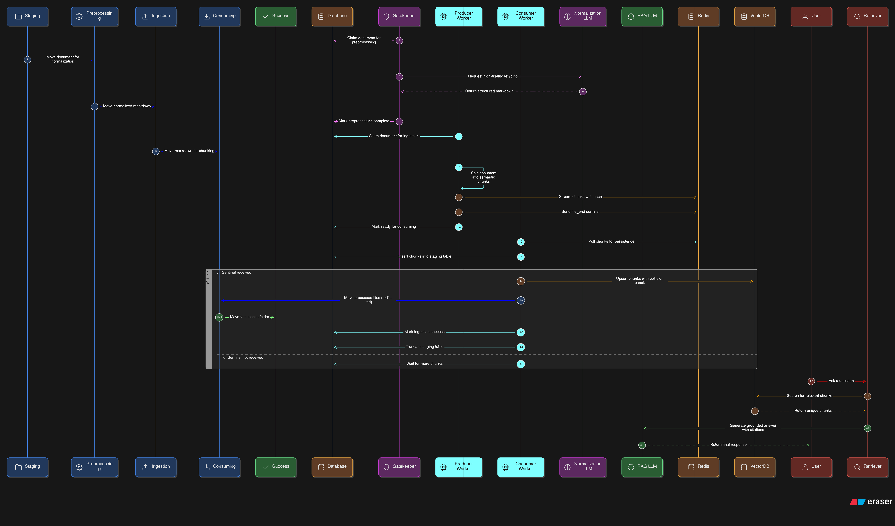
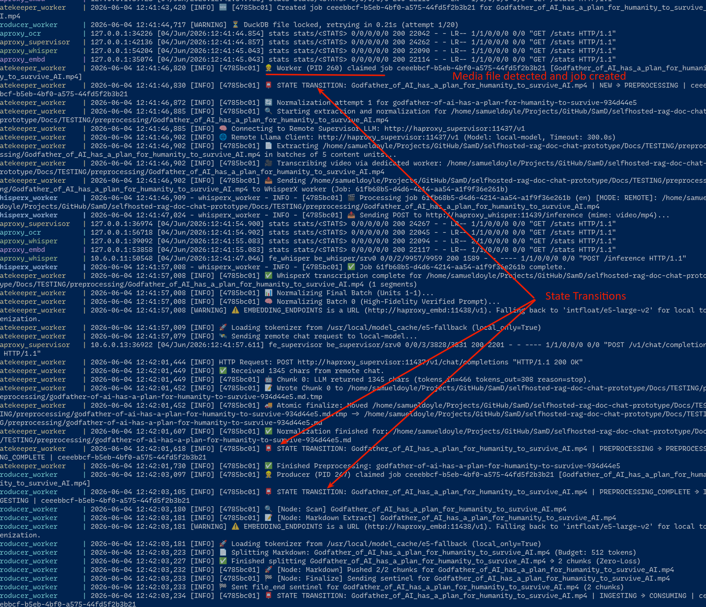
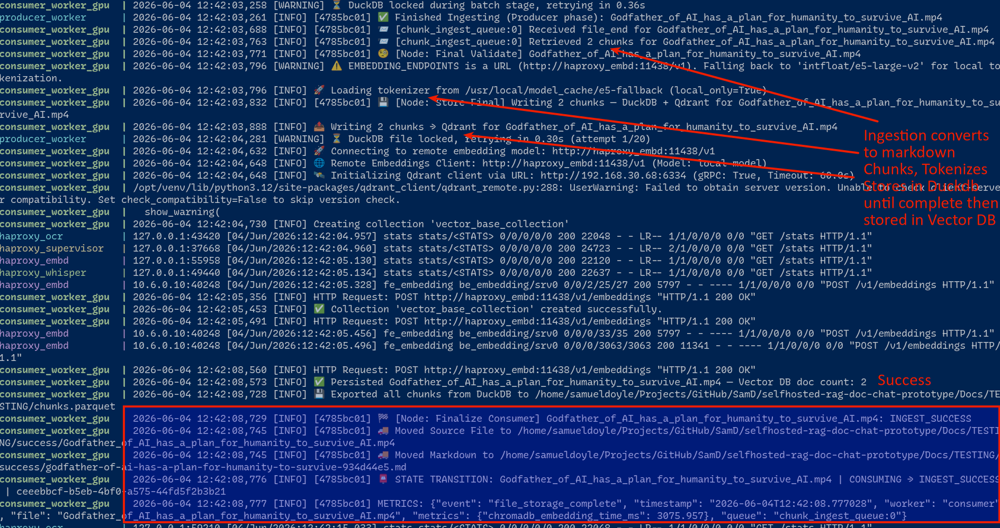
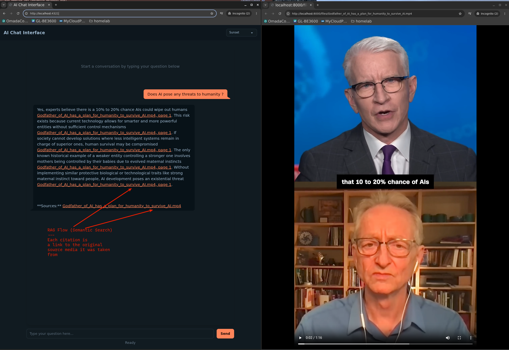

# Self-Hosted RAG Pipeline

A production-grade, air-gapped semantic search and document intelligence system. Drop PDFs, videos, or audio files into a folder and chat with them using an AI that cites its sources — all running on your own hardware with zero internet dependency.

> **⚠️ Work in Progress:** This branch (`nifi-testing-wip`) is integrating **Apache NiFi** into the ingestion pipeline as transparent middleware between Redis queues. NiFi provides data governance, provenance tracking, flow orchestration, and operational control over the ingestion lifecycle — without changing the worker code's Redis interface.
>
> ### NiFi Sandwich Architecture
>
> Each Redis queue is split into `_input` and `_output` halves. NiFi sits transparently between them — workers keep the same LPUSH/BRPOP interface and never touch NiFi directly. The NiFi UI shows one process group per queue, each containing a consumer→producer pair:
>
> ```mermaid
> flowchart LR
>     subgraph Workers
>         P[Producer Worker]
>         O1[ocr_utils]
>         W1[whisper_utils]
>     end
>     subgraph Consumers
>         C[Consumer Worker]
>         O2[ocr_worker]
>         W2[whisperx_worker]
>     end
>     subgraph Redis_Input["Redis _input queues"]
>         RI1[chunk:0_input]
>         RI2[ocr_processing_job_input]
>         RI3[whisper_processing_job_input]
>     end
>     subgraph Redis_Output["Redis _output queues"]
>         RO1[chunk:0_output]
>         RO2[ocr_processing_job_output]
>         RO3[whisper_processing_job_output]
>     end
>     subgraph NiFi["Apache NiFi — RAG Pipeline Process Group"]
>         direction TB
>         subgraph PG1["OCR Processing"]
>             OC[RedisQueueConsumer] --> OF[RedisQueueProducer]
>         end
>         subgraph PG2["Whisper Processing"]
>             WC[RedisQueueConsumer] --> WF[RedisQueueProducer]
>         end
>         subgraph PG3["Retype to Markdown LLM"]
>             RC[RedisQueueConsumer] --> RF[RedisQueueProducer]
>         end
>         subgraph PG4["Chunk and Tokenize Consumer"]
>         end
>     end
>     P -- RPUSH --> RI1
>     O1 -- LPUSH --> RI2
>     W1 -- LPUSH --> RI3
>     RI1 -- BRPOP --> OC
>     RI2 -- BRPOP --> WC
>     RI3 -- BRPOP --> RC
>     OF -- LPUSH --> RO1
>     WF -- LPUSH --> RO2
>     RF -- LPUSH --> RO3
>     RO1 -- BLPOP --> C
>     RO2 -- BRPOP --> O2
>     RO3 -- BRPOP --> W2
> ```
>
> **What NiFi brings at the middleware layer:**
>
> | Capability | How it helps |
> |------------|-------------|
> | **Data Governance** | Every FlowFile transformation is provenance-tracked. Full audit trail from file drop to vector storage — who processed what, when, and with which attributes. |
> | **Operational Control** | Backpressure thresholds prevent Redis queue overflow. Per-queue throughput, latency, and error rates visible in NiFi's UI or REST API. |
> | **Attribute Propagation** | `trace_id`, `file_name`, `queue_name`, and MIME type persist across the pipeline as FlowFile attributes. End-to-end observability without modifying worker payloads. |
> | **Data Validation** | Messages can be inspected, transformed, or rejected at the NiFi layer before they reach consumers. Malformed payloads caught early. |
> | **Formatting & Transform** | NiFi can normalize payload schemas, enrich attributes, and apply routing logic centrally — no changes needed in worker code. |
> | **Zero Worker Changes** | Workers use the same Redis LPUSH/BRPOP calls as before. Queue names gain `_input`/`_output` suffixes, resolved from environment — no worker code changes. |
> | **Auto-Recovery** | If NiFi is unavailable, the `nifi_bootstrap` service recreates the flow on next startup. Workers can fall back to direct Redis if needed. |
>
> ---

## About This Project

I built this system to solve a real problem: how do you make thousands of documents — PDFs, meeting recordings, video training, scanned archives — semantically searchable and queryable by natural language, without sending any data to a third party?

The answer is a distributed, multi-worker ingestion pipeline that runs entirely on dedicated LAN hardware. Every component — from the OCR fallback chain to the HAProxy load balancers to the DuckDB-backed state machine — is explicitly implemented for production-grade semantic search, not as a demo.

**This is production semantic search infrastructure, not a notebook.** It runs continuously, recovers from failures, load-balances across multiple GPUs, and has been tested against real-world document volumes.

---

## What It Does

| Format | How it's processed |
|--------|-------------------|
| `.pdf` (scanned) | OCR via Docling/EasyOCR |
| `.pdf` (text layer) | Direct extraction via pdfplumber |
| `.mp4`, `.mov`, `.mkv` | WhisperX speech transcription |
| `.mp3`, `.wav`, `.m4a`, `.aac`, `.flac` | WhisperX audio transcription |
| `.txt`, `.md`, `.html` | Direct read with charset detection |

**What you get out:** A semantic search chat interface where every answer sentence is traced back to its source with clickable citations linking to the original file and page.

Everything runs locally on dedicated LAN hosts — no cloud services, no external API calls, no data leaves your network.


---

## Architecture Highlights

### Distributed, Fault-Tolerant Pipeline

```
staging/ → Gatekeeper (extract + normalize to Markdown) → Producer (chunk + enqueue)
                                                          → Consumer (embed + store in Qdrant)
                                                          → success/
```

Six workers coordinate via Redis queues and a DuckDB-backed state machine with atomic `UPDATE ... RETURNING *` transitions. Each worker runs in its own Docker container with `restart: unless-stopped` for self-healing. The result is a semantic search pipeline that ingests, indexes, and retrieves documents by meaning, not just keyword matches.



### Production Engineering Decisions

| Decision | Rationale |
|----------|-----------|
| **Dual-LLM architecture** | Separate models for normalization (gatekeeper) and chat (RAG). Each optimized for its task — smaller context for normalization, larger for chat. |
| **Markdown-first normalization** | Raw text → clean Markdown → chunk. Eliminates OCR noise, page numbers, and footers before they reach the vector DB. |
| **Zero-drop chunking** | Hierarchical header splitting with recursive sub-splitting. No content is ever truncated — oversized chunks are split, not dropped. |
| **DuckDB staging** | Chunks are persisted to DuckDB before embedding. A file_end sentinel triggers atomic batch upsert to Qdrant — zero partial-visibility for RAG. |
| **HAProxy load balancing** | Auto-detects multiple LLM/embedding/Whisper/OCR backends and distributes requests with health checks and failover. |
| **Dual vector DB support** | Qdrant (gRPC + REST) and Chroma both supported via `VECTOR_DB_PROFILE`. |
| **Deterministic chunk IDs** | MurmurHash3-based IDs prevent duplicate vectors on re-ingestion. |
| **20-retry exponential backoff** | DuckDB lock contention is handled gracefully under high concurrency. |
| **Session-managed chat history** | Chat history stored in Redis per session ID, not passed client-side. Enables stateless API load balancing. |

### Tech Stack

**Backend**: Python 3.12, FastAPI, llama-cpp-python, LangChain (vector store wrappers only), Redis, DuckDB, Qdrant/Chroma, WhisperX, Docling, HAProxy

**Frontend**: Astro v6, Tailwind CSS v4, daisyUI 5.5

**Infrastructure**: Docker Compose with profile support (cuda/qdrant/chroma), multi-architecture worker images

---

## Quick Start

### Prerequisites

- Docker v2.20+
- Node.js v22.12.0+ (frontend only)

### Configure

All services connect over HTTP. Run them on any hosts in your LAN and set these variables before starting the stack.

```bash
# --- Filesystem ---
# Root directory for the local ingestion pipeline. Lifecycle subdirectories
# (staging/, preprocessing/, ingestion/, consuming/, success/) are created here.
export DEFAULT_DOC_INGEST_ROOT=/path/to/docs

# --- Vector Database ---
# Qdrant (default) or Chroma.
export VECTOR_DB_PROFILE=qdrant
# Remote Qdrant host. The system connects over gRPC on port 6334 by default.
# To use the REST API on port 6333 instead, set VECTOR_DB_USE_GRPC=false and prefix the URL with http://.
export VECTOR_DB_URL=<vector-db-host>:6334
export VECTOR_DB_USE_GRPC=true

# --- LLMs ---
# Chat model that answers RAG queries. Remote http(s):// URL or local .gguf path.
export LLM_PATH=http://<llm-host>:11434/v1/chat/completions
# Gatekeeper model that normalizes raw extracted text to Markdown during ingestion.
# Often points to the same host as LLM_PATH but serves a distinct role.
export SUPERVISOR_LLM_ENDPOINTS=http://<llm-host>:11434/v1/chat/completions

# --- Embedding ---
# Model that vectorizes document chunks during ingestion and user queries during chat.
# Remote http(s):// URL or local model directory path.
export EMBEDDING_ENDPOINTS=http://<embedding-host>:11434/v1/embeddings

# --- Audio / Video Transcription ---
# WhisperX host. Transcribes audio files (MP3, WAV, etc.) and extracts speech
# from video files (MP4, MOV, MKV) during ingestion.
export WHISPER_MODEL_ENDPOINTS=http://<whisper-host>:1145/inference

# --- OCR Fallback ---
# docling-serve host. Used when pdfplumber cannot extract text from a page
# (scanned documents, image-heavy pages). Set to "LOCAL" to run Docling
# inside the container instead.
export OCR_ENDPOINTS=http://<ocr-host>:5001/v1/convert/file
```

Full variable reference, local-file alternatives, and optional tuning flags are in [docs/quickstart.md](docs/quickstart.md).

### Multi-Endpoint Load Balancing

When you have multiple hosts running the same service, set `*_ENDPOINTS` env vars with comma-separated URLs. HAProxy starts automatically and distributes requests across all backends with health checks and failover.

```bash
export SUPERVISOR_LLM_ENDPOINTS=http://gpu0:11435/v1/chat/completions,http://gpu1:11436/v1/chat/completions
export EMBEDDING_ENDPOINTS=http://gpu0:11434/v1/embeddings,http://gpu1:11434/v1/embeddings
```

### NiFi Middleware (Required)

Apache NiFi is deployed as transparent middleware between Redis queues, providing flow orchestration, provenance tracking, and backpressure management. Workers continue using direct Redis calls — NiFi sits between `_input` and `_output` queues.

**Required Environment Variables:**

```bash
export NIFI_ENDPOINT="https://<nifi-host>:8443/nifi-api"
export NIFI_USERNAME="admin"
export NIFI_PASSWORD="<your-password>"
export NIFI_SSL_VERIFY="false"  # For self-signed certificates
```

**Deployment:**

The `nifi_bootstrap` service automatically deploys the flow on startup. It:
1. Waits for NiFi to become available
2. Creates the "RAG Pipeline" process group
3. Deploys RedisQueueConsumer and RedisQueueProducer processors for each queue
4. Starts all processors
5. Verifies flow health
6. Exits (one-shot service, doesn't restart)

**Manual Deployment:**

If you need to manually deploy or redeploy the flow:

```bash
# Deploy Python processors to NiFi (if not already deployed)
scp nifi/python/extensions/RedisQueueConsumer.py <nifi-host>:/opt/nifi/nifi-current/python/extensions/
scp nifi/python/extensions/RedisQueueProducer.py <nifi-host>:/opt/nifi/nifi-current/python/extensions/

# Run the bootstrap service
cd nifi/ && python nifi_bootstrap.py
```

See [nifi/README.md](nifi/README.md) for detailed deployment and operations documentation.

### Launch

```bash
./doc-ingest-chat/run-compose.sh --build
```

### Use

Drop files into `$DEFAULT_DOC_INGEST_ROOT/staging/`. The system auto-detects and processes them. Open [http://localhost:4321](http://localhost:4321) to chat with your documents.





---

## Documentation

| | | |
|---|---|---|
| **[Quick Start](docs/quickstart.md)** | Full environment configuration, service setup, and deployment diagram |
| **[Architecture](docs/overview.md)** | System flow, component map, state machine, and Redis queue architecture |
| **[Deep Dive](docs/deep-dive.md)** | Design rationale, dual-LLM architecture, chunking strategy, production roadmap |
| **[Operations](infra/operations/day-1.md)** | Setup checklist and Day 1 / Day 2 operational playbooks with symptom-driven runbooks |
| **[NiFi Middleware](nifi/README.md)** | Apache NiFi integration for flow orchestration, provenance tracking, and backpressure |
| **[Edge Agent](docs/edge-agent.md)** | Deploy MQTT SRE agents on standalone Debian minipcs for telemetry and task execution |
| **[Changelog](CHANGELOG.md)** | Version history and feature tracking |

---

## Why Air-Gapped?

Three reasons:

1. **Data sovereignty**: Legal, medical, and internal documents cannot be sent to third-party APIs. This system processes everything on your own hardware.
2. **Offline resilience**: No dependency on internet connectivity. Works in air-gapped environments, remote sites, or during outages.
3. **Cost predictability**: No per-token API costs. Once the hardware is in place, the marginal cost per document is effectively zero.

The system was designed from day one for air-gapped deployment — HuggingFace offline mode is baked into every container, all model paths support local files or LAN HTTP endpoints, and there are no hardcoded external service dependencies.

---

## About the Author

I'm a software engineer who builds semantic search and AI infrastructure that bridges the gap between research and production deployment. This project represents my approach to engineering: understand the problem deeply, build for reliability first, and make every architectural decision explicit and auditable.

If this kind of work interests you, let's talk. The best way to reach me is through GitHub.
