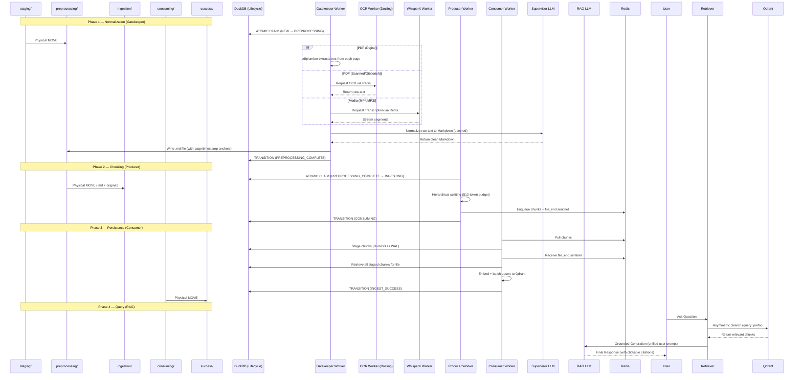
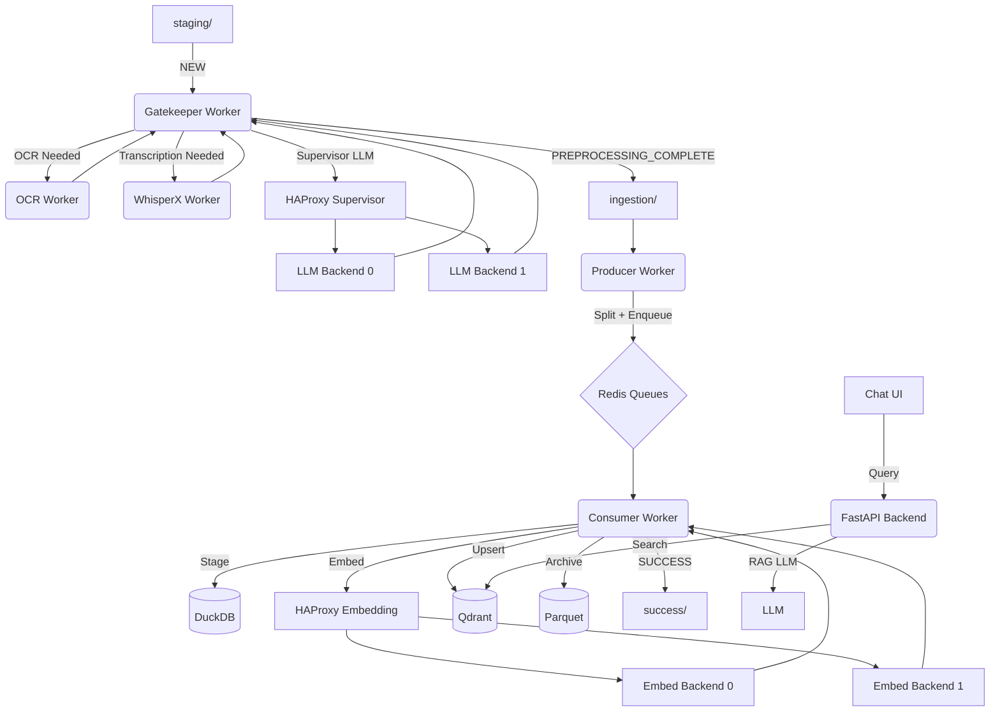

**[< Quick Start](quickstart.md) | [< README](../README.md) | [Deep Dive](deep-dive.md) | [Operations](operations.md)**

# Architecture Overview

This document covers the complete system architecture, data flow, and component map for the Self-Hosted RAG Ingestion & Chat system.

---

## System Philosophy

The system is built for **air-gapped, high-fidelity document ingestion** on commodity hardware (minipcs, eGPU docks). Every compute-heavy service — LLM, embeddings, WhisperX, OCR — runs as a standalone remote API endpoint on a dedicated host over the LAN. The ingestion worker stack connects to these services over HTTP. A **Database-Driven State Machine** tracks files through a multi-stage pipeline, prioritizing data integrity and traceability over raw speed.

### Core Mandates

- **Physical Isolation**: Files move between directories (`staging/` → `preprocessing/` → `ingestion/` → `consuming/` → `success/`) to ensure the physical state matches the database state at every step.
- **Dual-LLM Isolation**: The system separates the "Normalizer" from the "Chatter":
  - **Supervisor LLM** (`SUPERVISOR_LLM_PATH`): Structural transcription and high-density retyping of raw text into clean Markdown.
  - **RAG LLM** (`LLM_PATH`): Conversational reasoning and grounded retrieval with strict citation enforcement.
- **Atomic Handoffs**: Every stage transition is a "Move-then-Update" transaction in DuckDB, ensuring no document is lost or double-processed.
- **Load Balancing**: When multiple backends are available for any service (LLM, embeddings, WhisperX, OCR), HAProxy distributes requests across them with health checks, failover, and round-robin balancing.

---

## System Flow (Sequence Diagram)



---

## Component Architecture



---

## Physical Directory Moves

Files move through directories on disk as they progress through the pipeline. Directory moves and DuckDB state transitions are decoupled — some state changes occur without a directory move, and some directory moves happen without a state change.

| From Dir | To Dir | Worker | Description |
|----------|--------|--------|-------------|
| `staging/` | `preprocessing/` | Gatekeeper | Gatekeeper claims the file for extraction |
| `preprocessing/` | `ingestion/` | Gatekeeper | Normalized files handed off for ingestion |
| `ingestion/` | `consuming/` | Producer | Producer claims, moves files to isolation |
| `consuming/` | `success/` | Consumer | Files moved to permanent success archive |
| (any) | `failed/` | Any worker | Error occurred; files moved for debugging |

Files are placed into `staging/` by the user as a pre-pipeline action (not a worker transition).

## DuckDB State Machine Transitions

These are the state transitions tracked in the `ingestion_lifecycle` table. Compare with the directory moves above — some states are reached purely via database update with no file relocation.

| State Transition | Worker | Directory Move | Description |
|-----------------|--------|---------------|-------------|
| `NEW → PREPROCESSING` | Gatekeeper | `staging/ → preprocessing/` | Gatekeeper claims the file for extraction |
| `PREPROCESSING → PREPROCESSING_COMPLETE` | Gatekeeper | None | Normalization finished; `.md` file written |
| `PREPROCESSING_COMPLETE → INGESTING` | Producer | `ingestion/ → consuming/` | Producer claims, moves files to isolation |
| `INGESTING → CONSUMING` | Consumer | None | Chunks enqueued; files remain in `consuming/` |
| `CONSUMING → INGEST_SUCCESS` | Consumer | None | Qdrant upsert complete; files ready to archive |
| `→ INGEST_FAILED` | Any worker | (any) → `failed/` | Error occurred; files moved for debugging |

---

## Worker Roles

### Ingestion Workers

These workers communicate via Redis queues and operate on files through the pipeline stages:

| Worker | Entry Point | Queue(s) | Role |
|--------|------------|----------|------|
| **Gatekeeper** | `run_gatekeeper.py` | Claims from DuckDB | Extracts raw text via handler chain, normalizes to Markdown via Supervisor LLM, writes `.md` file |
| **OCR** | `run_ocr_worker.py` | `REDIS_OCR_JOB_QUEUE` | Processes image-based PDF pages via Docling/EasyOCR |
| **WhisperX** | `run_whisperx_worker.py` | `REDIS_WHISPER_JOB_QUEUE` | Transcribes audio/video files (`.mp3`, `.mp4`, `.wav`, `.mov`, `.mkv`) |
| **Producer** | `run_producer.py` | Reads from `ingestion/` | Claims normalized Markdown, splits into chunks with `[DOC_XXXX]` IDs, enqueues to Redis consumer queues, sends `file_end` sentinel |
| **Consumer** | `run_consumer.py` | `QUEUE_NAMES` (partitioned) | Buffers chunks in DuckDB, on sentinel: retrieves, embeds, upserts to Qdrant, archives to Parquet |

### API Server

The FastAPI backend serves HTTP requests on port 8000 — it does not operate on Redis queues:

| Component | Entry Point | Interface | Role |
|-----------|------------|-----------|------|
| **FastAPI** | `apimain.py` | HTTP :8000 | REST API for chat queries, status, and health checks |

The **Gatekeeper** worker uses the supervisor LLM (configured via `SUPERVISOR_LLM_PATH`) for normalization. The **RAG chat** uses a separate LLM (configured via `LLM_PATH`). In many deployments these run on the same GPU host but are distinct conceptual roles — normalization during ingestion vs. inference during chat.

---

## Content Handler Chain

The Gatekeeper uses a **Chain of Responsibility** pattern to extract raw text from files. Handlers are chained in priority order:

```
PDFContentTypeHandler → MP4ContentTypeHandler → MP3ContentTypeHandler → TextContentTypeHandler
```

| Handler | Extensions | Method |
|---------|-----------|--------|
| `PDFContentTypeHandler` | `.pdf` | `pdfplumber` (fast text-layer check); falls back to Docling/EasyOCR via OCR worker for scanned/gibberish pages |
| `MP4ContentTypeHandler` | `.mp4` | Delegates to WhisperX worker via Redis for transcription |
| `MP3ContentTypeHandler` | `.mp3`, `.wav` | Delegates to WhisperX worker via Redis for transcription |
| `TextContentTypeHandler` | `.txt`, `.md`, `.html` | Direct file read (charset-normalized for HTML) |

All handlers return a **generator stream** of raw text strings, which the Gatekeeper batches and sends to the Supervisor LLM for normalization.

---

## DuckDB State Machine

The `ingestion_lifecycle` table tracks every file through its complete journey:

```
NEW → PREPROCESSING → PREPROCESSING_COMPLETE → INGESTING → CONSUMING → INGEST_SUCCESS
                                                                       → INGEST_FAILED
```

Key properties:
- **Atomic claims**: Workers use `UPDATE ... RETURNING *` to atomically claim the next available job in a target state.
- **Retry logic**: All DuckDB operations use a **20-retry exponential backoff** to resolve lock contention across parallel workers.
- **Timestamp columns**: Each transition records a dedicated timestamp (`new_at`, `preprocessing_at`, `preprocessing_complete_at`, `ingesting_at`, `consuming_at`, `finalized_at`).

---

## Redis Queue Architecture

Queues enforce the 1:1 producer-to-consumer mapping for file-level affinity:

| Queue | Purpose |
|-------|---------|
| `REDIS_OCR_JOB_QUEUE` | Image-based pages sent from Gatekeeper to OCR Worker |
| `REDIS_WHISPER_JOB_QUEUE` | Audio/video files sent from Gatekeeper/Producers to WhisperX Worker |
| `QUEUE_NAMES` (e.g., `chunk_ingest_queue:0`, `:1`) | Partitioned queues — one per consumer process; Producer assigns a queue per file, so all chunks + the sentinel for a file arrive at the same consumer |

This 1:1 mapping ensures a single consumer owns all chunks for a file, providing file-level atomicity without distributed coordination.

---

## Protections Against Failures

1. **Partial Write Protection**: DuckDB acts as a Write-Ahead Log. Qdrant never sees half of a document — chunks are staged in DuckDB until the `file_end` sentinel arrives, then retrieved and upserted atomically.
2. **Deterministic IDs**: Chunks use MurmurHash3 content-addressable IDs. Re-ingesting a file cleanly overwrites existing chunks in Qdrant rather than duplicating them.
3. **IO Management**: Staging in DuckDB reduces simultaneous requests hitting Qdrant, protecting lower-powered hardware like minipcs.
4. **Crash Recovery**: If the Consumer crashes mid-upsert, the staged chunks remain in DuckDB and can be replayed on restart.

---

## Directory Structure

| Directory | Contents |
|-----------|----------|
| `doc-ingest-chat/workers/` | Worker entry points and LangGraph state machines |
| `doc-ingest-chat/handlers/` | Chain of Responsibility content extractors |
| `doc-ingest-chat/services/` | Business logic (database, Redis, RAG, jobs, parquet) |
| `doc-ingest-chat/config/` | Lazy-evaluated settings, GPU/CPU strategy, llama parameters |
| `doc-ingest-chat/api/` | FastAPI route definitions |
| `doc-ingest-chat/chat/` | Core RAG chat logic (retrieval, citation mapping, LLM prompting) |
| `doc-ingest-chat/processors/` | Text chunking, validation, zero-loss sub-splitting |
| `doc-ingest-chat/prompts/` | LLM prompt templates |
| `doc-ingest-chat/models/` | Pydantic/dataclass data structures |
| `doc-ingest-chat/utils/` | LLM setup, OCR, Whisper, tracing, logging |
| `doc-ingest-chat/sql/` | DuckDB schema definitions |
| `astro-frontend/` | Astro + Tailwind v4 + daisyUI chat UI (dark theme default, 11-theme picker) |

---

## Deployment

- **`./doc-ingest-chat/run-compose.sh --build`**: Full Docker Compose stack with profiles:
  - `--profile gpu` (default) — NVIDIA GPU acceleration
  - `--profile cpu` — CPU-only mode
  - `--profile qdrant` or `--profile chroma` — vector database selection
- **`./run-chat-system.sh`**: Local dev startup (FastAPI backend + Astro frontend)
- **Environment strategy**: `config/env_strategy.py` handles CUDA visibility and memory allocation based on `LLAMA_USE_GPU`
- **Network diagram**: See [docs/infra/sample-lab-deployment.puml](infra/sample-lab-deployment.puml) for the reference lab topology. This is a PlantUML diagram — use a PlantUML viewer (VS Code extension, [plantuml.com](https://www.plantuml.com), or `plantuml` CLI) to render it. Consider requesting a pre-rendered image if plaintext viewing is needed.

---

## HAProxy Load Balancing

When multiple backend endpoints are configured for any service, HAProxy automatically distributes requests across them. This is transparent to the Python workers — they see a single URL and HAProxy handles the routing.

### Supported Services

| Service | Env Var (endpoints) | HAProxy Port | Stats Port | Auto-Override |
|---------|-------------------|-------------|------------|---------------|
| Supervisor LLM | `SUPERVISOR_LLM_ENDPOINTS` | 11437 | 8404 | `SUPERVISOR_LLM_PATH` → `http://haproxy_supervisor:11437/v1` |
| Embeddings | `EMBEDDING_ENDPOINTS` | 11438 | 8405 | `EMBEDDING_MODEL_PATH` → `http://haproxy_embd:11438/v1` |
| WhisperX | `WHISPER_ENDPOINTS` | 11439 | 8406 | `WHISPER_MODEL_PATH` → `http://haproxy_whisper:11439/inference` |
| OCR | `OCR_ENDPOINTS` | 11440 | 8407 | `OCR_PATH` → `http://haproxy_ocr:11440/v1/convert/file` |

### Behavior by Endpoint Count

| Endpoints | Behavior |
|-----------|----------|
| 0 (unset) | HAProxy returns 503. The `*_PATH` env var is used directly (no haproxy dependency). |
| 1 | Transparent proxy to that single backend. |
| 2+ | `roundrobin` balancing with `httpclose` (no keep-alive pinning). Health checks on `/models` or `/health`. |

### How It Works

1. `run-compose.sh` detects `*_ENDPOINTS` env vars and auto-sets the corresponding `*_PATH` to the haproxy container URL.
2. The HAProxy entrypoint script (`infra/haproxy-entrypoint.sh`) generates the config at container startup from the `*_ENDPOINTS` env var.
3. Workers connect to haproxy as if it were a single backend. HAProxy distributes requests across all healthy backends.
4. Stats UI available at `http://localhost:<stats-port>/stats` for each service.

### Configuration

Endpoints are comma-separated URLs. Each URL can include the full path — HAProxy extracts `host:port` for routing and forwards the original request path.

```bash
export SUPERVISOR_LLM_ENDPOINTS=http://gpu0:11435/v1/chat/completions,http://gpu1:11436/v1/chat/completions
export EMBEDDING_ENDPOINTS=http://gpu0:11434/v1/embeddings
export WHISPER_ENDPOINTS=http://whisper0:1145/inference,http://whisper1:1145/inference
export OCR_ENDPOINTS=http://ocr0:5001/v1/convert/file,http://ocr1:5001/v1/convert/file
./doc-ingest-chat/run-compose.sh --build
```
