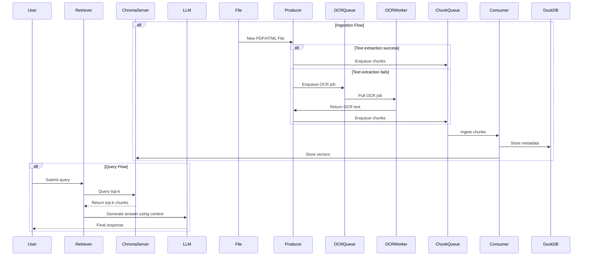

### 🧠 System Architecture

This document describes the core architecture of the self-hosted RAG pipeline.

#### 🔄 End-to-End Flow

```mermaid
sequenceDiagram
    participant User
    participant Retriever
    participant ChromaServer
    participant LLM

    participant File
    participant Producer
    participant OCRQueue
    participant OCRWorker
    participant ChunkQueue
    participant Consumer
    participant DuckDB

    alt Ingestion Flow
        File->>Producer: New PDF/HTML File
        alt Text extraction success
            Producer->>ChunkQueue: Enqueue chunks
        else Text extraction fails
            Producer->>OCRQueue: Enqueue OCR job
            OCRQueue->>OCRWorker: Pull OCR job
            OCRWorker->>Producer: Return OCR text
            Producer->>ChunkQueue: Enqueue chunks
        end

        ChunkQueue->>Consumer: Ingest chunks
        Consumer->>DuckDB: Store metadata
        Consumer->>ChromaServer: Store vectors
    end

    alt Query Flow
        User->>Retriever: Submit query
        Retriever->>ChromaServer: Query top-k
        ChromaServer-->>Retriever: Return top-k chunks
        Retriever->>LLM: Generate answer using context
        LLM-->>User: Final response
    end


```
