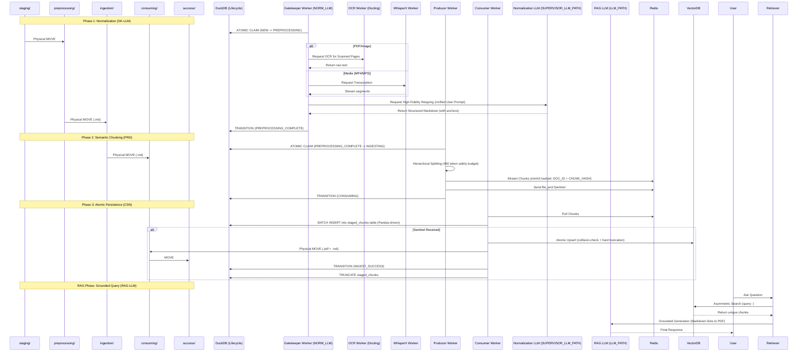

# Technical Architecture: Local RAG Pipeline

This document defines the technical specifications and data flow for the Self-Hosted RAG system.

---

## 🔄 Sequence Flow: Phased Ingestion & Physical State Machine


---

## 🏗️ System Components

### 1. State Machine (DuckDB + Redis)
- **`ingestion_lifecycle`**: The relational source of truth for file states. Tracks millisecond-precision timestamps for all transitions.
- **`staged_chunks`**: Persistent Pandas-driven buffer for OOM-safe processing of large files. Hardened with a **20-Retry Lock ceiling**.
- **Redis Partitions**: Ensures horizontal scalability and implements backpressure.

### 2. Large Language Models (LLMs)
The system is powered by two distinct Large Language Models using the **Unified User Prompt** architecture (all instructions in the User role):
- **Normalization LLM (`SUPERVISOR_LLM_PATH`)**: Stateless structural retyping into Markdown. Prioritizes denoising and structural repair.
- **RAG LLM (`LLM_PATH`)**: Conversational reasoning and grounded retrieval. Prioritizes citation accuracy and adherence to context.

### 3. Engine Roles
- **Gatekeeper LLM**: Handles OCR/Media fallback and LLM-driven structural normalization with explicit page/timestamp anchoring.
- **OCR Worker**: Dedicated Docling/EasyOCR engine for image-based text extraction.
- **Media Worker (WhisperX)**: Dedicated container for high-fidelity audio transcription and alignment.
- **Producer Engine**: Performs hierarchical semantic splitting (450-token limit) and mmh3 ID generation.
- **Consumer Engine**: Validates and executes atomic multi-sink persistence with a zero-drop hard truncation policy.

---

## 💾 Data Schema (DuckDB)

```sql
-- Lifecycle Tracking
CREATE TABLE ingestion_lifecycle (
    id VARCHAR PRIMARY KEY,
    status VARCHAR,
    original_filename VARCHAR,
    pdf_path VARCHAR,
    md_path VARCHAR,
    worker_id VARCHAR,
    error_log TEXT,
    new_at TIMESTAMP,
    preprocessing_at TIMESTAMP,
    preprocessing_complete_at TIMESTAMP,
    ingesting_at TIMESTAMP,
    consuming_at TIMESTAMP,
    finalized_at TIMESTAMP
);

-- Persistent Archival
CREATE TABLE parquet_chunks (
    id VARCHAR PRIMARY KEY,
    chunk TEXT,
    source_file VARCHAR,
    document_id VARCHAR,
    chunk_index INTEGER,
    page INTEGER,
    timestamp TIMESTAMP
);

-- Persistent Buffer
CREATE TABLE staged_chunks (
    id VARCHAR PRIMARY KEY,
    source_file VARCHAR,
    document_id VARCHAR,
    chunk TEXT,
    metadata JSON,
    timestamp TIMESTAMP
);
```
