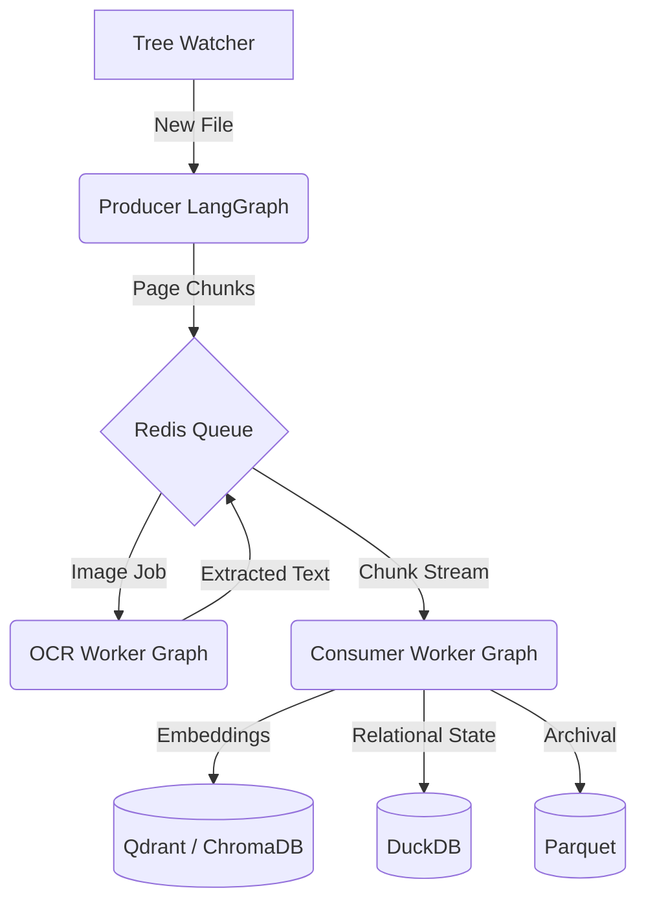

# Architecture Overview: LangGraph Streaming Ingestion

This document details the refactored, state-machine-based architecture of the RAG ingestion pipeline. The system transitioned from a procedural loop to a modular, streaming workflow orchestrated by **LangGraph**.

## 🏗️ Core Architecture

The system follows a distributed worker pattern where discrete specialized services communicate via **Redis** and persist state in **DuckDB**.

---

## 🛰️ Components

### 1. The Producer (Orchestrator)
The Producer is responsible for file discovery and initial text extraction.
- **Workflow**: Orchestrated by a `StateGraph` in `producer_graph.py`.
- **Nodes**:
    - `scan_file_node`: Validates file presence and determines type (PDF, HTML, Media).
    - `preview_node`: Scans the first 10 pages to extract a high-quality text sample.
    - `supervisor_node`: Uses **Qwen2.5-1.5B** to generate a single-sentence global context persona for the document.
    - `pdf_extract_node`: Uses `pdfplumber` for fast text-layer extraction.
    - `fallback_ocr_node`: Triggered if the fast extraction yields low-quality results.
    - `send_sentinel_node`: Dispatches the `file_end` signal to ensure consumer finalization.
- **Streaming**: Implements a callback-based system that pushes chunks to Redis page-by-page, minimizing memory overhead for large documents.

### 2. The OCR Worker (Computer Vision)
Handles scanned documents using a distributed worker pool.
- **Workflow**: Defined in `ocr_graph.py`.
- **Logic**: Pops base64 images from Redis, decodes them, executes Docling (EasyOCR) OCR, and pushes results back to a dedicated reply key.
- **Efficiency**: Only invoked when the Producer detects a scanned or unreadable page.

### 3. The Consumer (Ingestion & Storage)
The final stage of the pipeline where data is vectorized and stored.
- **Incremental Ingestion**: Unlike the original system, the Consumer now writes to the Vector DB **as soon as a batch is filled** (e.g., every 50 chunks), rather than waiting for the end of the file.
- **Workflow**: Finalized by `consumer_graph.py` upon receiving the `file_end` sentinel.
- **Responsibility**: Handles embedding generation, Vector DB insertion, Parquet archiving, and updating the final job status.

---

## 💾 State Management & Persistence

### Job Tracking (DuckDB)
The `JobService` provides a relational source of truth for the entire ingestion lifecycle. This ensures that the system is **restart-resilient**.
- **Statuses**: `pending` → `processing` -> `chunking` → `enqueuing` → `enqueued` (Producer done) → `completed` (Consumer done).
- **Retry Logic**: Every database operation includes exponential backoff to handle concurrent file access locks gracefully.

### Data Layers
1.  **Vector DB (Qdrant/Chroma)**: Used for high-speed semantic retrieval during chat.
2.  **Parquet**: Acts as a cold-storage archival format for all ingested chunks.
3.  **DuckDB**: Stores relational metadata (`parquet_chunks`) and job statuses (`file_ingestion_jobs`).

---

## 🚀 Key Performance Features

-   **Streaming Extraction**: Memory usage stays constant regardless of document size (e.g., 50MB vs 500MB PDFs).
-   **Batch Concurrency**: Multiple consumer workers can drain the Redis queues in parallel, while the `JobService` ensures atomic status updates.
-   **Observability**: Detailed node-level logging and a structured metrics system (`metrics.jsonl`) provide real-time insight into processing bottlenecks.
