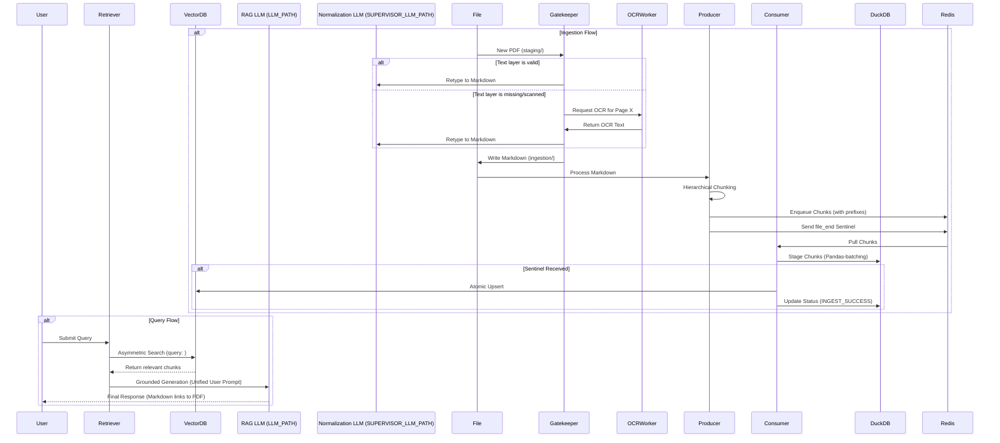
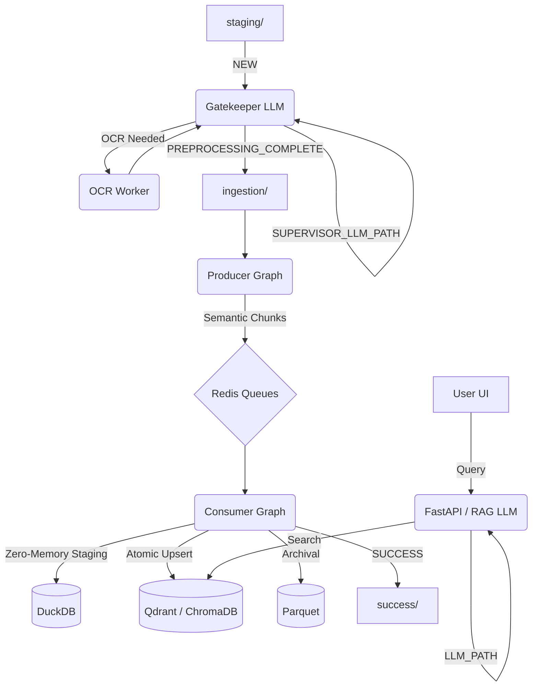

# Architectural Overview: Local RAG Pipeline

This document provides a comprehensive deep-dive into the architecture, data flow, and components of the Self-Hosted RAG Ingestion & Chat system.

---

## 🔄 System Flow Diagrams

### 1. End-to-End Ingestion & Query Flow


### 2. Component Architecture


---

## 1. System Philosophy
The system is built for **air-gapped, high-fidelity document ingestion**. It prioritizes data integrity and traceability over raw speed, using a **Database-Driven State Machine** to move files through a multi-stage pipeline.

### Core Mandates:
*   **Physical Isolation**: Files move between directories (Staging -> Preprocessing -> Ingestion -> Consuming -> Success) to ensure the physical state matches the database state.
*   **Dual-LLM Isolation**: The system separates the "Normalizer" from the "Chatter."
    *   **Normalization LLM**: Specialized for structural transcription and high-density retyping.
    *   **RAG LLM**: Specialized for conversational reasoning and grounded retrieval.
*   **Atomic Handoffs**: Every stage transition is a "Move-then-Update" transaction in DuckDB, ensuring no document is ever lost or double-processed.
*   **Memory Safety**: PDF handles and image buffers are explicitly cleared before the LLM is loaded to prevent OOM on large documents.

---

## 2. The Case for Normalization: Markdown vs. Raw Tokens

Converting raw text tokens directly into a vector database is a "low-quality" RAG strategy. By normalizing to **Markdown** first, the system transitions from **Syntactic Chunking** (splitting by character count) to **Semantic Chunking** (splitting by logical meaning).

### Why the Markdown Path is Superior:

#### **1. Noise Elimination**
Raw PDF/OCR text is full of "technical slop": running footers, page numbers, and repeated book titles.
- **Raw Approach**: Footer text like "THE OUTLINE OF HISTORY" appears in every chunk, polluting the vector space and burying actual answers.
- **Markdown Approach**: The Normalization LLM strips these artifacts. Every token in the Vector DB is **100% content**, ensuring top-k retrieval results are actually relevant.

#### **2. Contextual "Healing"**
OCR is never perfect; it produces artifacts like "C0nstantine" or broken line breaks.
- **Raw Approach**: A search for "Constantine" will fail to find the chunk containing "C0nstantine."
- **Markdown Approach**: The LLM uses its world knowledge during retyping to "heal" these errors. It recognizes the entity and fixes the spelling **before** it is indexed, ensuring search terms always find their targets.

#### **3. Structural Integrity (Logical Boundaries)**
- **Raw Approach**: Chunks are cut at arbitrary token limits. This often splits a critical sentence or a list of facts right down the middle, leaving half the context in one chunk and half in another.
- **Markdown Approach**: Because we have `##` and `###` headers, the **Producer** performs **Hierarchy-Aware Splitting**. It preserves the "connective tissue" of the information by splitting at paragraph breaks (`\n\n`) rather than in the middle of a sentence.

#### **4. Semantic Density**
Embedding models like `e5-large-v2` look for the "essence" of a passage. Markdown headers provide a massive boost to the "Attention" mechanism. A chunk that starts with `## CHAPTER VIII: THE ANCESTRY OF MAN` immediately tells the embedding model exactly what the following text is about, creating much tighter, higher-quality semantic clusters in the vector space.

---

## 3. Technical Architecture & Component Roles

### 📡 Coordination Layer (Redis & DuckDB)
*   **Redis**: Acts as the high-speed message broker. It handles partitioned chunk queues and OCR task offloading.
*   **DuckDB (`chunks.duckdb`)**: The "Brain" of the system. Tracks the **Lifecycle Registry** and acts as a **Relational Buffer** for staged chunks. Hardened with a **20-Retry Lock ceiling** and exponential backoff.

### 👷 Worker Ecosystem (The Engine)

#### **1. GateKeeper (The Normalizer)**
*   **Input**: `staging/` (Status: `NEW`)
*   **Role**: Claims raw PDFs and performs **Normalization**.
*   **LLM Role**: Uses the **Normalization LLM** (`SUPERVISOR_LLM_PATH`) to "retype" the raw text into clean Markdown.
*   **Page Tracking**: Injects explicit `### [INTERNAL_PAGE_X]` anchors into the Markdown file to preserve the physical PDF page boundaries across the LLM generation.
*   **Outcome (The "Why")**: Critical for RAG quality. It denoises OCR artifacts, structures hierarchical headers, and "heals" misspellings before they reach the vector database.
*   **Output**: `preprocessing/` -> `ingestion/` (Status: `PREPROCESSING_COMPLETE`)

#### **2. Producer (The Chunker)**
*   **Input**: `ingestion/` (Status: `PREPROCESSING_COMPLETE`)
*   **Role**: Performs **Hierarchical Splitting**.
*   **Logic**: Uses the headers generated by the Gatekeeper to split the document into units that strictly fit the **450-token safety limit**.
*   **Deduplication**: Generates MurmurHash3 IDs (`DOC_ID + CHUNK_HASH`) for deterministic deduplication.
*   **Enrichment**: Prepends the mandatory `passage: [DOC_ID]` prefix to every chunk **before** enqueuing, ensuring the Consumer validates the final stored string.
*   **Output**: `consuming/` (Status: `INGESTING`)

#### **3. Consumer (The Persister)**
*   **Input**: Redis Partitioned Queues
*   **Role**: Persistent staging, final validation, and multi-sink storage.
*   **High-Performance Staging**: Chunks are **immediately written to DuckDB** (`staged_chunks` table) using a Pandas-driven batch staging method to resolve lock contention.
*   **Zero-Drop Policy**: If a chunk exceeds the 512-token limit, the validator **hard-truncates** it to 511 tokens instead of dropping it, ensuring 100% data persistence.
*   **Atomic Persistence**: When the sentinel arrives, it executes a single LangGraph transaction to persist to Qdrant, Parquet, and update DuckDB.
*   **Output**: `success/` or `failed/`

---

## 3. The RAG Stack (The Interface)

### **Backend: FastAPI + LangChain**
*   **RagService**: Orchestrates the conversational retrieval chain.
*   **LLM Role**: Uses the **RAG LLM** (`LLM_PATH`) for grounded generation.
*   **Unified User Prompt**: Moves all instructions and context blocks into the User role to maintain focus for smaller models (0.5B / 3B).
*   **ChromaChat Logic**:
    *   **Prefix-Matching**: Automatically prepends `query: ` to match the `passage: ` prefix.
    *   **Regex Anchor Parsing**: Uses an underscore-aware regex to extract `[DOC_ID]` from the prefixed content for accurate citation.
    *   **Clickable PDF Links**: Maps model-generated citations back to actual file names and direct Markdown links to the `/files` route.

### **Frontend: AstroJS + Tailwind**
*   **Astro Component**: A reactive chat interface located in `astro-frontend/`.
*   **Simulation Flow**: Maintains local conversation history and displays real-time system status.

---

## 4. Key Performance Features
-   **Streaming Extraction**: Constant memory usage regardless of PDF size.
-   **Batch Concurrency**: Multiple consumers can drain Redis in parallel using hardened retry loops.
-   **Observability**: Node-level logging and a structured metrics system.

---

## 5. Quickstart & Deployment

### **Launch Sequence**
1.  **Configure Environment**: Set `DEFAULT_DOC_INGEST_ROOT`, `SUPERVISOR_LLM_PATH`, and `LLM_PATH`.
2.  **Start Services**:
    ```bash
    ./doc-ingest-chat/run-compose.sh --build
    ```
3.  **Ingest**: Drop a PDF into `Docs/staging`.
4.  **Chat**: Open `http://localhost:4321`.
